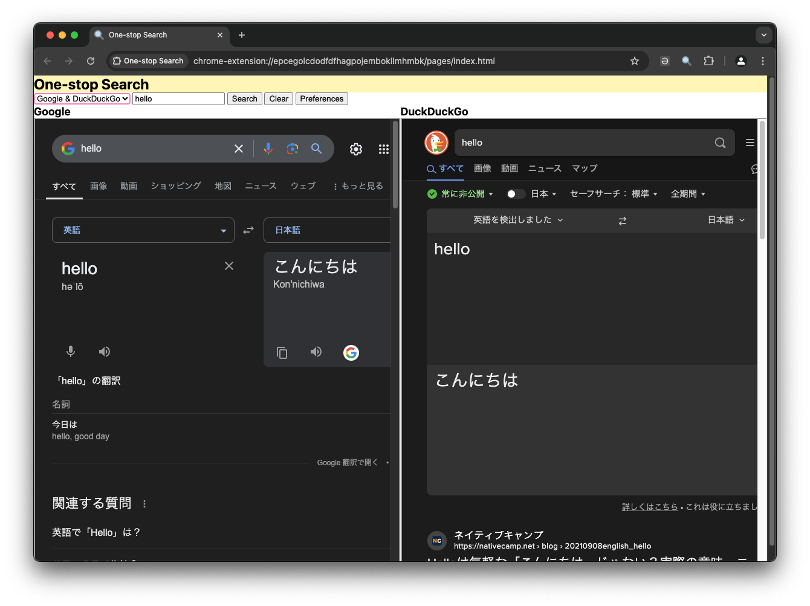

# One-stop search

Search with multiple search engine, compare the results side-by-side.

## Permission required

- Read and change all your data on all websites
  - Block content on any page
    - It is needed to allow the extension to embed search engine websites in iframes on its page, and to allow the extension to make cross-origin request.

## Credits

The favicon was generated using the following graphics from Twitter Twemoji:

- Graphics Author: Copyright 2020 Twitter, Inc and other contributors (https://github.com/twitter/twemoji)
- Graphics Source: https://github.com/twitter/twemoji/blob/master/assets/svg/1f50d.svg
- Graphics License: CC-BY 4.0 (https://creativecommons.org/licenses/by/4.0/)
